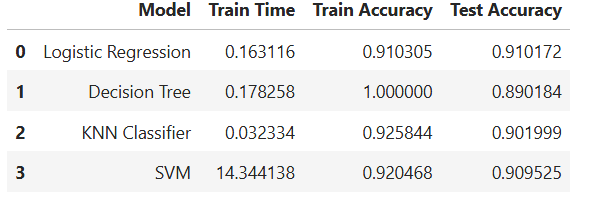

### Business case
The increasingly vast number of marketing campaigns over time has reduced its effect on the general public. Furthermore, economical pressures and competition has led marketing managers to invest on directed campaigns with a strict and rigorous selection of contacts. Such direct campaigns can be enhanced through the use of Business Intelligence (BI) and Data Mining (DM) techniques.

### Purpose
The purpose of the project is to find out  effectiveness for future marketing campaigns for the bank.  we analyze the last marketing campaign the bank performed and identify the patterns that will help us find conclusions in order to develop future strategies.


### Dataset
The dataset has following fields:
```
age                 int64
job                object
marital            object
education          object
default            object
housing            object
loan               object
contact            object
month              object
day_of_week        object
duration            int64
campaign            int64
pdays               int64
previous            int64
poutcome           object
emp.var.rate      float64
cons.price.idx    float64
cons.conf.idx     float64
euribor3m         float64
nr.employed       float64
y                  object
```

### Modeling
The modeling was performed using multiple models. Following models were used:

```
    Logistic Regression
    Decision Tree
    KNeighborsClassifier
    Support Vector Machine
```
### Model Comparison
Here is the comparison of all 4 models



The highest accuracy was obtained with Logistic Regression. KNN was the fastest model to train and SVM took more time.
Decsion Tree had a very high accuracy on trining but low on testing. Overall Logistic Regression provoded best performance. 

### Notebooks
[Notebookmodeling](prompt_III.ipynb)

### Conclusion
In this effort we used 4 models for training the data. The models were traiined using default parameters. We can improve the models further by using grid search to find best paramters. 

We still could not answer which marketing techniques are effective in the future. For that we need further analysis.
This effort help us to find out which model is suitable for this task.
